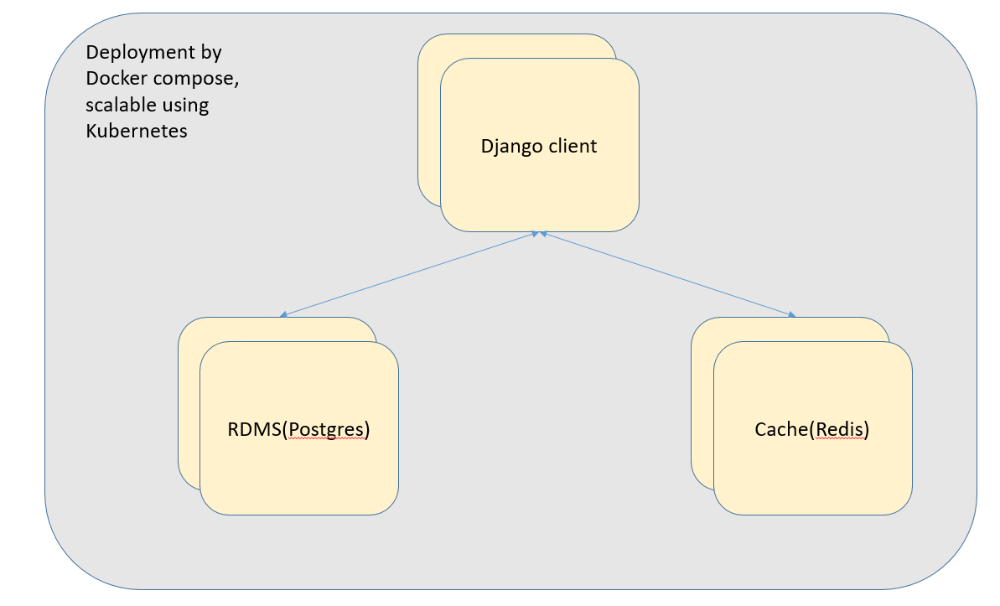

# URL SHORTENER

This project replicates parts of [tinyurl](https://tinyurl.com/app)

## What we want

- High read performance
    - For url shortener, read performance is more important than write. We will design a caching mechanism to accomodate this observation.
- Easy to deploy
    - We use Docker compose for 1 line service deployment.
- Scalable
    - We write every microservice into their respective Dockerfiles, so Kubernetes deployment will be easier later.

## System design

### Architecture



### Microservice components

1. Client
    - For ease of development, we chose Django to implement both frontend and backend. Django is also great for scaling(Containerization).
    - Django will receive original url input then return a shortened url. Django web server implements the rest API end points and interacts with Postgres and Redis services.
    - We will also record users' usage in DB for analytics(Table might be very huge so need to clean data once in a while).
2. RDMS
    - We chose PostgreSQL as our service as it is more [optimized for concurrency](https://blog.panoply.io/postgresql-vs.-mysql). 
3. Cache
    - We chose Redis as it is very good for high read application.

### Procedure

1. First, client get original url from user. Before any transaction, we will check for url's validity. Upon verification, url is sent to hashlib module for md5 hashing. However, collision might occur. We will slide left over md5 hash if collision occurs. It is astronomically unlikely we will ever face any complete hash collision.
2. Original url and shortened url will be saved to PostgreSQL database. We assume write operations are severely lesser than read.
3. When user wants to redirect to the original url, first an attempt to fetch the original url from the Redis cache is made. For cache-miss, we fetch original url from PostgreSQL, then cache it and return the original Url.
4. For every access to our short url redirection service, we will save some details including location in our database. Location identification provided by ipstack. Data will be used in analytics later.
5. Title tag will be parsed using urllib and bs4. We need to store Title Tag to prevent application from running scraper all the time for same urls. If we try to save everything in a single table, it might become huge and impose serious problems over time. Therefore we design our applcation with a separate table(horizontal sharding) for free deletion in case it becomes our performance bottleneck

## Deployment

1. Install [Docker](https://docs.docker.com/engine/install/ubuntu/) and docker-compose: `sudo apt install docker-compose`
2. Clone this repository
3. Run: 
```sh
cd src
docker-compose up
```
4. Visit http://ip:3000


## Databases

We use Django as ORM to PostgreSQL DB. This saves us a lot of works and troubles of writing SQL queries.

Models are defined in `src/client/urlshortener/tinyurl/models.py`. Snippet:
```python
# table to store Url mappings
class Url(models.Model):
    shorturl = models.CharField(max_length=15, primary_key=True)
    originalurl = models.CharField(max_length=500)

# table to record each redirection used
# foreign key to Url for more efficient analytics
class UrlAnalytics(models.Model):
    url = models.ForeignKey(Url, on_delete=models.CASCADE)
    countrycode = models.CharField(max_length=10)
    timestamp = models.DateTimeField(auto_now_add=True)
    
# this table stores Title Tag to prevent application from running scraper all the time for same urls
# we create a new model in DB because of scaling consideration
# this TitleTag table might become huge and impose serious problems over time
# with a separate table(horizontal sharding), we can freely delete the whole table(or partial) if ever this table becomes our performance bottleneck
class TitleTag(models.Model):
    longurl = models.CharField(max_length=500)
    titletag = models.CharField(max_length=150)
```

## API Endpoints

Defined in src/client/urlshortener/tinyurl/urls.py

## Analytics

We can use Google Analytics but that requires a domain(and our data!). For this assignment, manual requests' data collection is enough. We created a UrlAnalytics table in our DB for this purpose. We also exposed an endpoint(http://ip:3000/shorturl/a/) for easier view.

## Test

### Functional test

Most functional unit tests written in `src/client/urlshortener/tinyurl/tests.py`. Details are written as comments.

### Endpoint test

For some endpoint test not coverable in functional test, we exposed some extra endpoint to test the Django views with their respecive components. (In `src/client/urlshortener/tinyurl/urls.py`)

- url_set: To test if endpoint can return correct short url calculated by our lib and if they are persistent in DB or cache.
- url_get: To test if user can recover the short url back to original url and display them correctly in view.
- geo_info: To test functionality of api provided by ipstack to read location based on ip address. We do not check this in unit test because API is provided by ipstack.

### Performance test

Performance test should not be an issue for this assignment because our design is easily scalable by Kubernetes. However, we will still check for it to ensure it is not some demo project which doesn't work for more than 2 simultaneous users. Performamce test done inside test directory.

## Examples

deployment:


frontend and result:


redirection analytics:


## Follow up

We can still do a lot to improve our application, including:

- Async for some critical time functions
- Distributed key-value service as middleware for cache and database for even more robust and scalable content distribution. [Demo application](https://github.com/kmykoh97/distributed-key-value-database)
- CDN
- Kubernetes
- Full CI integration with Jenkins

*Special thanks to CoinGecko for this assignment*
